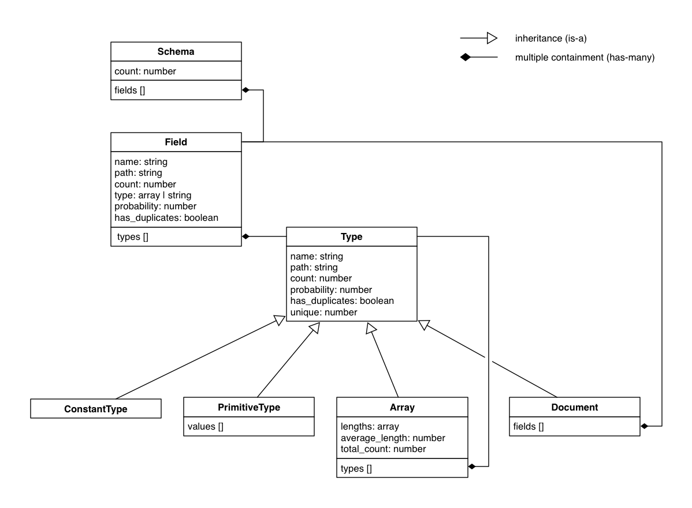

# mongodb-schema [![][npm_img]][npm_url] [![][travis_img]][travis_url] [![][coverage_img]][coverage_url] [![][gitter_img]][gitter_url]

> Infer a probabilistic schema for a MongoDB collection.

## Example

`mongodb-schema` doesn't do anything directly with `mongodb` so to try the examples we'll install the node.js driver.  As well, we'll need some data
in a collection to derive the schema of:

1. `npm install mongodb mongodb-schema`.
2. `mongo --eval "db.test.insert([{_id: 1, a: true}, {_id: 2, a: 'true'}, {_id: 3, a: 1}, {_id: 4}])" localhost:27017/test`
3. Create a new file `parse-schema.js` and paste in the following code:
  ```javascript
  var parseSchema = require('mongodb-schema');
  var connect = require('mongodb');

  connect('mongodb://localhost:27017/test', function(err, db){
    if(err) return console.error(err);

    parseSchema('test.test', db.collection('test').find(), function(err, schema){
      if(err) return console.error(err);

      console.log(JSON.stringify(schema, null, 2));
      db.close();
    });
  });
  ```
4. When we run the above with `node parse-schema.js`, we'll see something
  like the following:

  ```javascript
  {
    ns: 'test.test',
    count: 4, // The number of documents sampled
    fields: [ // A collection of Field objects @see lib/field.js
      {
        name: "_id",
        probability: 1, // Just as we expected, all 4 documents had `_id`
        unique: 4, // All 4 values for `_id` were unique
        types: [
          {
            name: "Number", // The only type seen was a Number
            probability: 1,
            unique: 4
          }
        ]
      },
      {
        name: "a", // Unlike `_id`, `a` was present in only 3 of 4 documents
        probability: 0.75,
        unique: 3, // Of the 3 values seen, all 3 were unique
        // As expected, Boolean, String, and Number values were seen.
        // A handy instance of `Undefined` is also provided to represent missing data",
        "types": [
          {
            name: "Boolean",
            probability: 0.25,
            unique: 1
          },
          {
            name: "String",
            probability: 0.25,
            unique: 1
          },
          {
            name: "Number",
            probability: 0.25,
            unique: 1
          },
          {
            name: "Undefined",
            probability: 0.25
          }
        ]
      }
    ]
  }
  ```

### More Examples

`mongodb-schema` supports all [BSON types][bson-types].
Checkout [the tests][tests] for more usage examples.

## Installation

```
npm install --save mongodb-schema
```

## Testing

```
npm test
```

## License

Apache 2.0

## Contributing

Under the hood, `mongodb-schema` uses [ampersand-state][ampersand-state] and
[ampersand-collection][ampersand-collection] for modeling [Schema][schema], [Field][field]'s, and [Type][type]'s.

A high-level view of the class interactions is as follows:




[bson-types]: http://docs.mongodb.org/manual/reference/bson-types/
[ampersand-state]: http://ampersandjs.com/docs#ampersand-state
[ampersand-collection]: http://ampersandjs.com/docs#ampersand-collection
[tests]: https://github.com/mongodb-js/mongodb-schema/tree/master/test
[schema]: https://github.com/mongodb-js/mongodb-language-model/blob/master/lib/schema.js
[field]: https://github.com/mongodb-js/mongodb-language-model/blob/master/lib/field.js
[type]: https://github.com/mongodb-js/mongodb-language-model/blob/master/lib/type.js

[travis_img]: https://secure.travis-ci.org/mongodb-js/mongodb-schema.svg?branch=master
[travis_url]: https://travis-ci.org/mongodb-js/mongodb-schema
[npm_img]: https://img.shields.io/npm/v/mongodb-schema.svg
[npm_url]: https://www.npmjs.org/package/mongodb-schema
[coverage_img]: https://coveralls.io/repos/mongodb-js/mongodb-schema/badge.svg
[coverage_url]: https://coveralls.io/r/mongodb-js/mongodb-schema
[gitter_img]: https://badges.gitter.im/Join%20Chat.svg
[gitter_url]: https://gitter.im/mongodb-js/mongodb-js
